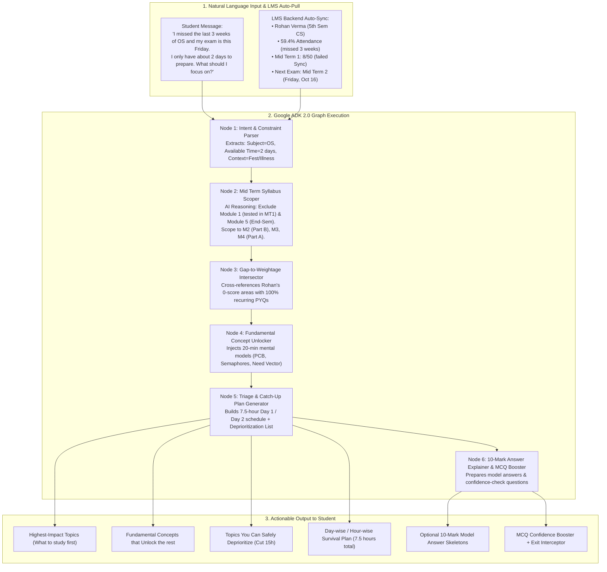

# "Back on Track" – Google ADK 2.0 Graph Architecture & Data Plan

> **Core Promise:** "Missed classes or had an emergency? Let’s get you Back on Track."  
> The student enters a single natural-language message. The system pulls the academic history, syllabus scope, and question weightage from the university LMS to build an immediate catch-up roadmap.

---

## 1. End-to-End Workflow & Google ADK 2.0 Graph Nodes

---

## 2. Updated Data Files Summary

| File Name | Purpose & Contents |
| :--- | :--- |
| [`lms_student_context.json`](file:///home/puneeth/programmes/bitsom_vertex/lms_student_context.json) | **Simulated LMS Student Profile:** Rohan Verma, 59.4% attendance, 3-week fest gap, Mid Term 1 score (8/50), unattempted quizzes, and flagged weak spots. |
| [`os_midterm_syllabus.json`](file:///home/puneeth/programmes/bitsom_vertex/os_midterm_syllabus.json) | **Scoped Mid Term 2 Syllabus:** Demonstrates AI reasoning by scoping *only* Modules 2(B), 3, and 4(A). Explicitly drops Modules 1 and 5. |
| [`midterm_pyq_weightage.json`](file:///home/puneeth/programmes/bitsom_vertex/midterm_pyq_weightage.json) | **50-Mark Mid Term Exam Pattern:** 4 past years of internal question papers showing exact recurring question pairs (e.g. Q1.A SRTF vs Q1.B Multilevel queue). |
| [`fundamental_concepts_os.json`](file:///home/puneeth/programmes/bitsom_vertex/fundamental_concepts_os.json) | **Prerequisite Unlock Principles:** 20-minute mental models for Process States, Semaphore tokens, Banker's Need matrix, and Paging address offsets. |

---

## 3. The Mid Term Syllabus Scoping Logic (Why the AI is Smart)

In standard technical universities, **Mid Term 2 (Internal Assessment 2)** only tests the syllabus covered between Week 5 and Week 11:
- **Module 1 (Introduction & System Calls):** ❌ Excluded (already examined in Mid Term 1).
- **Module 2 (Part B - CPU Scheduling):**  Included (12 Marks).
- **Module 3 (Synchronization & Deadlocks):**  Included (26 Marks).
- **Module 4 (Part A - Main Memory & Paging):**  Included (12 Marks).
- **Module 4 (Part B - Virtual Memory & Page Replacement):** ❌ Excluded (post-midterm).
- **Module 5 (File Systems & Mass Storage):** ❌ Excluded (post-midterm).

**Result:** The AI instantly removes 55% of the total textbook syllabus *before* even ranking topics, saving the student from panicking about Virtual Memory or File Systems.

---

## 4. Terminology Alignment (Strictly Enforced)

We avoid generic buzzwords like "20% / 80%":
-  **Highest-impact topics for the remaining time**
-  **Critical topics you must cover**
-  **Fundamental concepts that unlock the rest of the subject**
-  **Topics you can safely deprioritize right now**

---

## 5. Ideal Input → Output Simulation

### Student Input:
> *"I missed the last 3 weeks of Operating Systems because of the college cultural fest and my exam is this Friday. I only have about 2 days to prepare. What should I focus on to catch up and do well?"*

### Backend Automated Recognition:
- **Student Recognized:** Rohan Verma (5th Sem CS).
- **Target Exam Identified:** Mid Term 2 (`CS304`), Friday Oct 16 (48 hours away).
- **Syllabus Isolated:** Modules 2(B), 3, and 4(A) (50 Marks paper).
- **LMS Gaps Detected:** 0/15 in Synchronization; unattempted Banker's quiz; zero lecture slides opened for Paging.

### Output Generated:
1. **Highest-Impact Topics (34 out of 50 Marks):**
   - *Preemptive CPU Scheduling (SRTF & Round Robin)* — 12 Marks (2.0h prep)
   - *Banker's Algorithm Safety Sequence* — 10 Marks (2.0h prep)
   - *Producer-Consumer with Semaphores* — 10 Marks (1.5h prep)
   - *Paging TLB Effective Access Time* — 8 Marks (1.0h prep)
2. **Fundamental Concepts to Clear First (1.0h total):**
   - *Token Mental Model for `wait()` & `signal()`* (25 mins) → Unlocks Producer-Consumer.
   - *The Need Vector Formula* (15 mins) → Unlocks Banker's Algorithm.
   - *Page Offset vs Frame Shelf Analogy* (20 mins) → Unlocks Paging.
3. **Topics You Can Safely Deprioritize Right Now:**
   - *Dining Philosophers & Monitors* (Saves 2.5h — always paired against Producer-Consumer).
   - *Multilevel Feedback Queue theory* (Saves 1.5h).
   - *Segmentation Hardware* (Saves 1.5h).
4. **2-Day Catch-Up Schedule (7.5 Study Hours Total):**
   - **Thursday (Day 1 - 4.5 Hours):** CPU Scheduling Numerical + Semaphore Unlock + Producer-Consumer Code.
   - **Friday Morning (Day 2 - 3.0 Hours):** Banker's Algorithm + Paging Hardware & TLB + 15-minute formula recap.
5. **MCQ Confidence Booster:** 3 interactive diagnostic checks with instant rationale.
