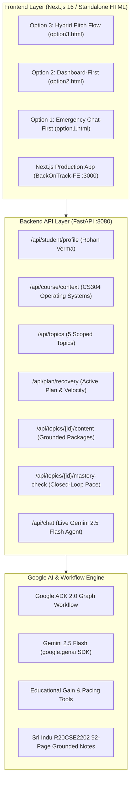

# Product Requirements Document (PRD)

## Product: "Back on Track"
**Tagline:** Autonomous Academic Triage & Dynamic Pace Recalibration Engine for Interrupted Learning  
**Event:** BITSoM Vertex Builders' Pitch Fest 2026 (Room T03, Academic Block 1)  
**Track:** EdTech AI Problems (Academic Decisions • Learning Outcomes • Time Management)

---

## 1. Executive Summary & Problem Definition

### The Core Problem:
In Indian engineering universities (JNTUH, VTU, BITS, Autonomous colleges), high-stakes core technical subjects like Operating Systems (`CS304` / `R20CSE2202`) exhibit backlog failure rates of up to 38%. When real-world interruptions strike—leading a 3-week college cultural fest (e.g. Malhar), medical hospitalization (dengue), sports tournaments, or family emergencies—students face catastrophic time debt with **less than 48 to 72 hours** remaining before Mid Term internal assessments.

Students do not lack textbooks or videos; **they suffer from severe panic-induced decision paralysis**:
1. Paralyzed by 92-page lecture notes and 5 sprawling units.
2. Inability to distinguish high-probability 10-mark compulsory numericals from low-yield descriptive theory.
3. Lack of immediate prerequisite micro-models (e.g. attempting Banker's algorithm without understanding Need matrix subtraction).
4. No closed-loop feedback or pacing recalibration when study sessions run behind schedule, leading to exhaustion and sleep deprivation.

### The Solution:
**"Back on Track"** is an autonomous closed-loop academic triage engine:
1. **Conversational Emergency Entry:** The student articulates their emergency in natural language:
   > *"I missed 3 weeks of Operating Systems due to fest organizing, only have 6 hours left before Friday's exam, how do I pass?"*
2. **Deterministic Google ADK 2.0 Graph Workflow:** A 4-node deterministic graph workflow executes with real Google Gemini 2.5 Flash:
   - **Node 1 (IntentParser):** Parses student constraints (available days, hours budget).
   - **Node 2 (LMSExtractor):** Connects LMS history (Rohan Verma, 59.4% attendance, IA-1 deficit of 8/50).
   - **Node 3 (KnowledgeScoper):** Scopes syllabus strictly to Mid Term 2 exam, pruning Units 1 & 5 to preserve 6.5 hours of sleep.
   - **Node 4 (PlanSynthesizer):** Synthesizes a prioritized 5-topic recovery route with verified educational gain ($g = 76.2\%$) and study velocity ($8.53\text{ marks/h}$).
3. **Grounded Course Content:** Mapped directly to the official [Sri Indu College of Engg & Tech – R20CSE2202 Operating Systems Notes](https://sriindu.ac.in/wp-content/uploads/2023/10/R20CSE2202-OPERATING-SYSTEMS.pdf) (92 pages, JNTUH Curriculum).
4. **Pop-up Mastery Quiz Dialogs:** Dedicated interactive pop-up modals for each topic featuring progressive 3-question diagnostic checks (Concept, Calculation, Trap) with instant feedback and explanations.
5. **Overall Mock Exam Assessment:** 5-question holistic check that diagnoses weak areas and recommends specific **"Topics to Read Again"**.
6. **Closed-Loop Dynamic Recalibration:** Completing topics dynamically updates study velocity, recalibrates remaining durations, and adjusts readiness metrics in real time.

---

## 2. Target Student Persona

| Dimension | Specification |
| :--- | :--- |
| **Name & Identity** | **Rohan Verma** (USN: `1RV22CS104`) |
| **Program & Semester** | B.Tech Computer Science & Engineering • 3rd Year / 5th Semester |
| **Target Assessment** | **CS304 Operating Systems Mid Term 2 (Internal Assessment 2)** — Friday |
| **Interruption Reason** | Lead Coordinator, 3-Week Inter-Collegiate Cultural Fest (*Waves 2026*) |
| **Attendance State** | **59.4%** (Missed 15 lecture hours / 3 weeks of active classes) |
| **Diagnostic History** | IA-1 Score: **8 / 50 Marks** (Flagged 0/15 in Synchronization; Deadlocks unattempted) |
| **Urgent Objective** | Secure safe pass / First Class (40+ out of 50 marks) within available 6-hour budget |

---

## 3. The 5 In-Scope Curriculum Topics (Grounded in Sri Indu R20CSE2202)

| Topic Key | Unit & Citation in Notes | Topic Name & Academic Scope | Exam Weightage |
| :--- | :--- | :--- | :--- |
| `cpu-scheduling` | Unit II, Lectures 9–12 *(Pages 19–24)* | **Preemptive CPU Scheduling (SRTF & Round Robin)** Criteria, preemption rules, tick-by-tick Gantt chart, CT/TAT/WT. | **12 Marks Numerical** |
| `synchronization` | Unit III, Lectures 16–20 *(Pages 31–40)* | **Process Synchronization (Semaphores & Bounded Buffer)** Critical Section rules, Counting/Binary semaphores, Producer-Consumer code. | **10 Marks Compulsory** |
| `deadlocks` | Unit III, Lectures 25–28 *(Pages 43–52)* | **Deadlocks (Banker's Algorithm & Safe State Verification)** Coffman conditions, Need matrix, Work vector addition, Safe sequence. | **10 Marks Compulsory** |
| `memory-management` | Unit IV, Lectures 29–33 *(Pages 53–64)* | **Main Memory & Paging Hardware (TLB & Address Translation)** Logical $(p,d)$ to Physical $(f,d)$, TLB hit/miss, EMAT derivation. | **10 Marks Numerical** |
| `virtual-memory` | Unit IV, Lectures 34–37 *(Pages 65–76)* | **Virtual Memory & Page Replacement (FIFO, LRU & Belady's Anomaly)** Demand paging fault routine, FIFO vs LRU simulation, Belady's anomaly. | **10 Marks Numerical** |
| *Pruned Scope* | Units 1 & 5 *(Pages 3–14, 81–92)* | OS Services, System Calls & Disk Scheduling (SSTF/SCAN) dropped to preserve 6.5 hours of sleep before Friday exam. | 0 Marks in MT2 |

---

## 4. Assessment & Quiz Engine Architecture

### A. Topic-Level Interactive Pop-Up Quiz (Modal Dialog)
- Activated via dedicated **"Take Mastery Quiz"** buttons on topic cards or inside the reading view.
- Pops up in a clean, focused modal dialog (never buried at the bottom of long pages).
- **3 Progressive Questions per Topic:**
  - Question 1: Theoretical Concept & Operating System Rules.
  - Question 2: University Exam Numerical / Matrix Arithmetic.
  - Question 3: Common University Grading Trap.
- Instant color-coded feedback (Emerald Green for correct, Crimson Red for wrong).
- Examiner marking scheme explanation citing exact lecture slide and page numbers.
- Score tracker ($0/3, 1/3, 2/3, 3/3$). Submitting updates topic to **Completed** and recalibrates velocity.

### B. Overall Final Exam Mock Assessment (5 Cross-Topic Questions)
- Accessible from the main dashboard via **"Overall Exam Mock Quiz (5 Topics)"**.
- Evaluates holistic student readiness across all 5 core modules.
- Generates score report ($0-5$) and diagnoses conceptual blind spots.

### C. Diagnostic Revision Recommender ("Topics to Read Again")
- Any topic where a student answered questions incorrectly is flagged as a **weak area**.
- Displays an amber **"Recommended Topics to Read Again"** alert banner on the dashboard with direct 1-click action buttons (e.g. `🔄 Re-read: Banker's Algorithm`) linking directly to that topic guide.

---

## 5. Architectural & Technical Stack

---

## 6. Verification & Quality Gates

1. **LLM Agent Quality:** Real Gemini 2.5 Flash API calls with structured Pydantic intent parsing; zero forbidden buzzwords.
2. **ADK 2.0 Graph Workflow:** Python ADK `Workflow` with deterministic node edges passing `Event(output=...)`.
3. **Frontend Tests:** `vitest run` passes 7/7 tests; `tsc --noEmit` clean with 0 errors.
4. **Interactive Experience:** All 5 topics, pop-up quizzes, overall mock exam, and closed-loop recalibration functional on `http://localhost:8080` and `http://localhost:3000`.
